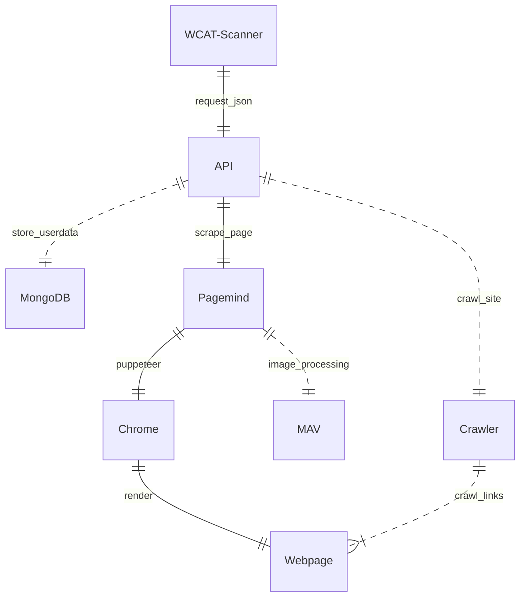

# WCAT-Scanner

WCAT-Scanner CLI tool

## Setup Instructions

### Requirements

Make will fail with warnings if requirements are not met.

You need:

- [Make](https://www.gnu.org/software/make/)
- [CMake](https://cmake.org)
- [Docker Compose v2](https://docs.docker.com/compose/compose-v2/)
- [Cargo](https://www.rust-lang.org/learn/get-started)

### Build

`make`

## Documentation

Documentation can be found at [docs.wcat.dev](https://docs.wcat.dev).

### Architecture

    

        
        
    

    

        
        
    

[How to read an erDiagram.](https://www.lucidchart.com/pages/er-diagrams)

## RoadMap
